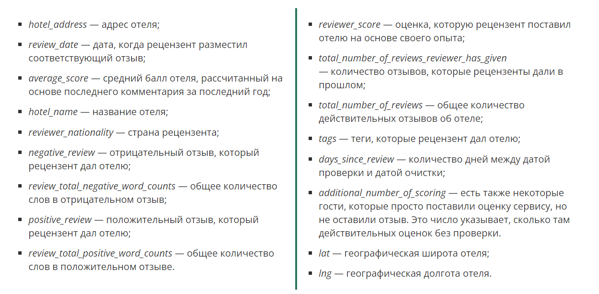

# Проект "Booking - отзывы на отели"

## Оглавление  
[1. Описание проекта](README.md#Описание-проекта)  
[2. Какой кейс решаем?](README.md#Какой-кейс-решаем?)  
[3. Краткая информация о данных](README.md#Краткая-информация-о-данных)  
[4. Результаты](README.md#Результаты)

### Описание проекта    
 Представим, что мы работаем дата-сайентистом в компании Booking. Одна из проблем компании — это нечестные отели, которые накручивают себе рейтинг. Одним из способов обнаружения таких отелей является построение модели, которая предсказывает рейтинг отеля. Если предсказания модели сильно отличаются от фактического результата, то, возможно, отель ведёт себя нечестно, и его стоит проверить.

:arrow_up:[к оглавлению](README.md#Оглавление)

### Какой кейс решаем?    
Необходимо преобразовать, исследовать и очистить предоставленные данные и построить ML модель, добиться того, чтобы метрика MAPE была меньше 13.5

:arrow_up:[к оглавлению](README.md#Оглавление)

### Краткая информация о данных
[Скачать тренировочные данные можно перейдя по этой ссылке.](https://drive.google.com/file/d/1AOlrAxBfhlQySfZctGQ8PwO4pgv1002R/view?usp=share_link)

[Скачать тестовые данные можно перейдя по этой ссылке.](https://drive.google.com/file/d/1SHoVVKj5IvUK1D-ckuMLQgd5ZPL2KxJJ/view?usp=share_link)

[Скачать файл submission можно перейдя по этой ссылке.](https://drive.google.com/file/d/1oyLeUar1pMfl3bFRQbTOFdBRf5QIhhzk/view?usp=share_link)

  
**Примечание**: все данные в проекте хранятся в папке data.

:arrow_up:[к оглавлению](README.md#Оглавление)

### Результаты  
В результате работы были объединены тренировочный и тестовый наборы данных, преобразованы и очищены данные. Были найдены и визуализированы
взаимосвязи между признаками. Были проведены генерация и отбор признаков. В итоге была построена ML модель RandomForestRegressor и показатель MAPE составил 13.4

:arrow_up:[к оглавлению](README.md#Оглавление)

Если информация по этому проекту покажется вам интересной или полезной, то я буду очень вам благодарен, если отметите репозиторий и профиль